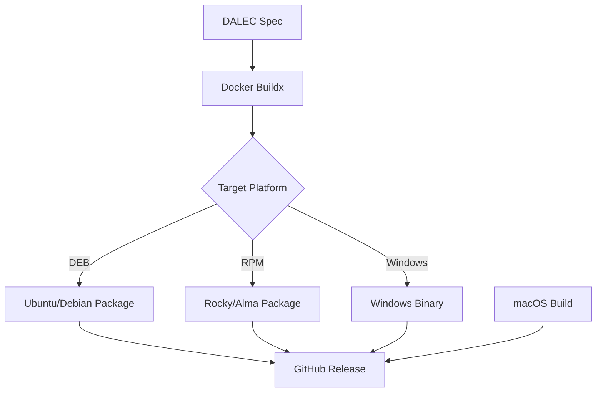

# Spry SQLPage DALEC Architecture

This document describes the architecture and design decisions for the Spry SQLPage DALEC packaging project.

## Overview

This project uses [DALEC](https://github.com/project-dalec/dalec) to build cross-platform packages for the Spry SQLPage CLI tool. DALEC is a Docker Buildkit frontend that translates declarative YAML specifications into build instructions for multiple Linux distributions and Windows.

## Project Structure

```
spry_dalec/
├── .github/
│   └── workflows/
│       ├── build.yml          # Main build workflow for all platforms
│       └── test.yml           # Testing workflow
├── scripts/
│   └── release.sh             # Release automation script
├── dalec-spry-sqlpage.yaml    # DALEC specification file
├── spry_sqlpage.ts            # Main Spry SQLPage TypeScript file
├── import_map.json            # Deno import map
├── Makefile                   # Build automation
├── docker-compose.yml         # Docker Compose for local builds
├── README.md                  # User documentation
├── BUILD.md                   # Build instructions
├── CONTRIBUTING.md            # Contribution guidelines
├── ARCHITECTURE.md            # This file
└── LICENSE                    # MIT License

```

## Build Process

### 1. DALEC Specification

The `dalec-spry-sqlpage.yaml` file defines:

- **Package metadata**: name, version, description, license
- **Sources**: 
  - Deno binary (downloaded from GitHub releases)
  - Import map (from Spry repository)
  - Main TypeScript file (inline)
- **Build steps**: 
  - Extract Deno
  - Compile TypeScript to standalone binary
  - Package the binary
- **Targets**: Ubuntu, Debian, Rocky Linux, Alma Linux, Windows

### 2. Build Targets

#### DEB Packages (Debian/Ubuntu)
- **jammy**: Ubuntu 22.04 LTS
- **bookworm**: Debian 12

#### RPM Packages (RHEL-based)
- **rockylinux9**: Rocky Linux 9
- **almalinux9**: Alma Linux 9

#### Windows
- **windowscross**: Cross-compiled Windows binary

#### macOS
- Built separately using native Deno compilation on macOS runners

### 3. GitHub Actions Workflow

The CI/CD pipeline consists of:

1. **Build Jobs**: Parallel builds for each target platform
2. **Test Jobs**: Validation of built packages
3. **Release Job**: Automatic release creation on version tags

## Key Design Decisions

### Why DALEC?

1. **Unified Build Process**: Single YAML spec for multiple platforms
2. **Supply Chain Security**: Built-in SBOM and provenance support
3. **Docker-Native**: Leverages BuildKit's caching and parallelization
4. **Reproducible Builds**: Consistent builds across environments

### Why Deno Compile?

1. **Single Binary**: No runtime dependencies
2. **Cross-Platform**: Works on Linux, macOS, and Windows
3. **Self-Contained**: Includes all dependencies
4. **Fast Startup**: No JIT compilation needed

### Package Structure

The compiled binary is installed to `/usr/local/bin/spry-sqlpage` and includes:
- Deno runtime
- All TypeScript code
- Import map dependencies
- Spry SQLPage CLI

## Build Flow



## Dependencies

### Build-Time
- Docker with BuildKit
- Docker Buildx
- Deno (for macOS builds)

### Runtime
- ca-certificates (for HTTPS)
- No other dependencies (self-contained binary)

## Security Considerations

1. **Source Verification**: All sources are downloaded from official repositories
2. **Checksums**: DALEC verifies source integrity
3. **Minimal Attack Surface**: Single binary with no external dependencies
4. **Supply Chain**: SBOM generation for transparency

## Future Enhancements

1. **Package Signing**: GPG signing for DEB/RPM packages
2. **Homebrew Formula**: macOS package manager support
3. **Chocolatey**: Windows package manager support
4. **ARM Support**: ARM64 builds for Linux and macOS
5. **Container Images**: Docker images with spry-sqlpage pre-installed

## References

- [DALEC Documentation](https://project-dalec.github.io/dalec/)
- [Spry Project](https://github.com/programmablemd/spry)
- [Deno Compile](https://deno.land/manual/tools/compiler)
- [Docker Buildx](https://docs.docker.com/buildx/working-with-buildx/)

